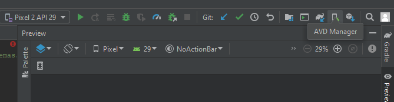
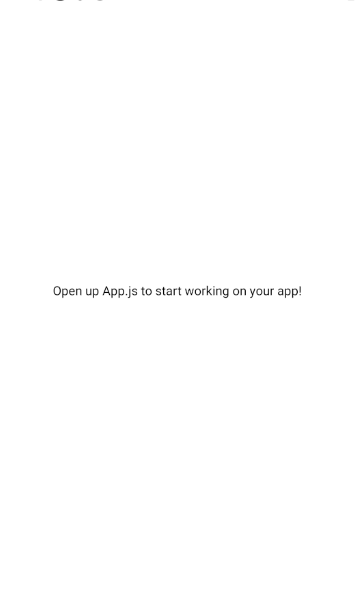

# React Native Template

A React Native app created with

```shell
expo init template
```


## Setup

Here is the setup for creating this project template

1. Although you can use the React Native CLA, I could not get it to work without bugs. I used the Expo CLI Quickstart with

   ```shell
   npm install -g expo-cli
   ```

2. Create the project with

   ```shell
   expo init #projectName
   ```

3. cd to the project and npm start like a react project

   ```shell
   cd AwesomeProject
   npm start # you can also use: expo start
   ```


## Debugging

You have two options for developing a React Native app with Android. You can use a emulator or a physical device to test


First I will show how to create an Android emulations with Android Studio (this is not the only option and you may chose another Android emulator)

1. Install [Android Studio](https://developer.android.com/studio)

2. The next steps is after npm start command

3. You will see a QR code and some options

4. Here you can use a physical device and follow the sets at the bottom of the page

5.  

   Open emulator by going into the Android studio and selecting **AVD Manager**. You can create a new device and select the defaults if you do not have a device already

6. Type a for Android emulator in shell and it may take a while for it to initialize on bash and on the android emulator

7. In step 6 or 2, you will see website popup. This is the Expo control panel

8. In the android emulator, you will see the JavaScript build. Wait for this to finish and you may have to go back and enter the project again if it gets stuck and 100%

9.  

   Once you see the screen above, you are finished

10. You can do live editing in your code editor!


Resource: https://reactnative.dev/docs/environment-setup

or https://www.youtube.com/watch?v=0DhQd_EK1Ng


The second and probably better option is to use a physical device as it will reflect a closer state to the real deployment of React Native

The instructions can are [here](https://reactnative.dev/docs/running-on-device)

